姓名：冯运
学号：1160300524
第三次作业：E-R模型

1.E-R模型的三个主要的概念是什么？分别简要解释之。

实体：是E-R模型的基本对象，是对现实世界中各种事物的抽象，可以是代表物理存在的事物，也可以抽象的概念
属性：是数据库中存储的主要数据，代表了实体的某个性质或特征。
联系：不同实体集之间可能存在的某种关联称为实体间的联系

2.为一个银行设计一个数据库，包括顾客和顾客的账户的相关信息。
(1)顾客的信息包括姓名、地址、电话和社会安全号码。
(2)顾客可以有多个地址（地址是由所在州、城市、街道组成的三元组），每个地址可以有多个电话。
(3)账户的信息包括号码、类型（支票账户或者储蓄账户）和收支情况，也应记录它的所有者。
(4)一个账户只能有一个所有者。
试：画出对应的E-R图；指出每个关系中的主键和外键和完整性约束；把E-R图转化为对应的关系模式。

关系模式：
$账户(号码，类型，收支情况，\underline{所属顾客的社会安全号码})$
$顾客(姓名，社会安全号码，电话)$
$地址(州，城市，街道，\underline{顾客的社会安全号码})$
$地址电话(电话号码，\underline{州，城市，街道})$

账户关系中：
主键：号码 外键：所属顾客的社会安全号码 
实体完整性约束：账户的号码不能为空，且不能重复
关联完整性约束：所属的顾客不能为空，且在顾客关系中已经存在
语义完整性约束：账户类型的值必须为支票账户或者储蓄账户之一

顾客关系中：
主键：社会安全号码
实体完整性约束：社会安全号码不能为空，且不能重复
语义完整性约束：姓名不能为空 电话不能为空

地址关系中：
主键：州 城市 街道 外键：顾客的社会安全号码
实体完整性约束：州 城市 街道都不能为空，且不能重复
关联完整性约束：顾客不能为空，且在顾客关系中已经存在

地址电话关系中：
主键：电话号码 外键：州 城市 街道
实体完整性约束：电话号码为空，且不能重复
关联完整性约束：州 城市 街道都不能为空，且在地址关系中已经存在

3.设某商业集团数据库中有三个实体集。一是“商店”实体集，属性有商店编号、商店名、地址等；二是“商品”实体集，属性有商品号、商品名、规格、单价等；三是“职工”实体集，属性有职工编号、姓名、性别、业绩等。商店与商品间存在销售关系，每个商店可销售多种商品，每种商品也可放在多个商店销售，每个商店销售每一种商品有月销售量；商店与职工间存在着聘用关系，每个商店有许多职工，每个职工只能在一个商店工作，商店聘用职工有聘期和月薪。
试：画出对应的E-R图；将E-R图转换成关系模式，并标明每个关系的主键和外键。
 

 关系模型：

 商品关系(商品号，商品名，规格，单价) 
 主键：商品号

 商店关系(商店编号，商店名，地址) 
 主键：商店编号

 职工关系(职工编号，姓名，性别，业绩，商店编号，聘期，月薪) 
 主键：职工编号 
 外键：商店编号

 销售关系(商品编号，商店编号，月销售量) 
 主键：商品编号，商店编号 
 外键：商品编号，商店编号